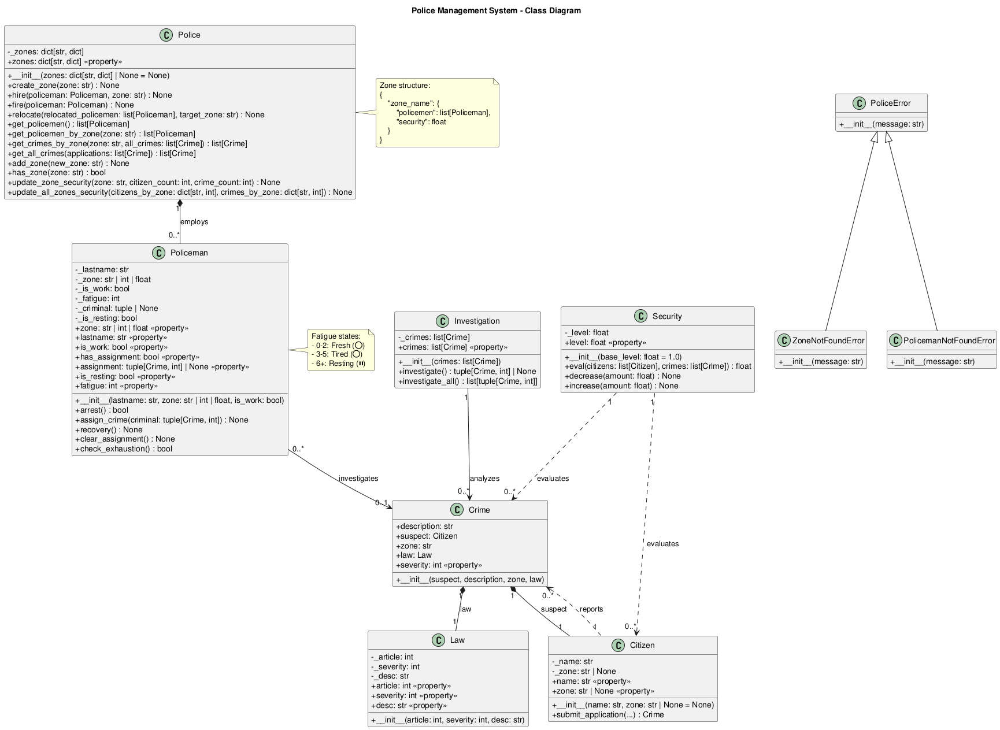
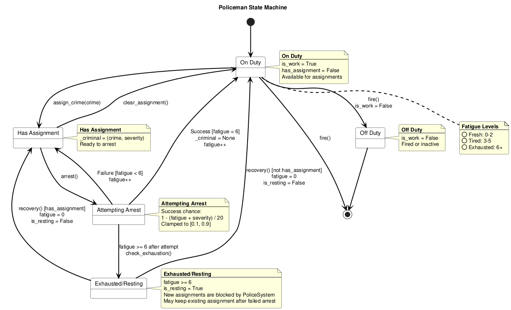
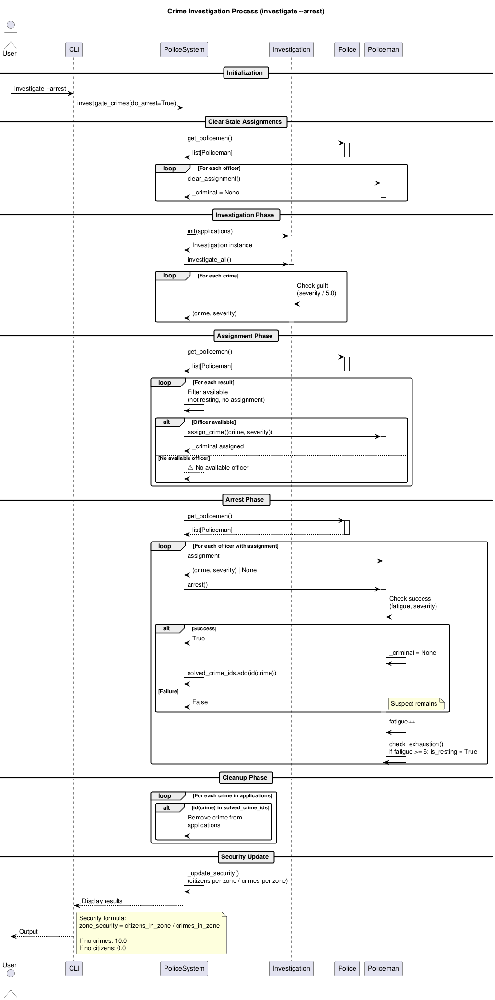

# Verification of Requirements

Данный документ подтверждает соответствие системы управления полицией всем указанным требованиям.

## Общие требования

| Требование | Статус | Реализация |
|------------|--------|------------|
| **Совместимость с PEP8** | Выполнено | Код следует рекомендациям PEP8 (именование, длина строк, импорты) |
| **Аннотации типов** | Выполнено | Все функции и методы имеют аннотации типов |
| **Обработка исключений** | Выполнено | Иерархия исключений: `PoliceError`, `ZoneNotFoundError`, `PolicemanNotFoundError` |
| **CLI-интерфейс** | Выполнено | Интерактивный режим и режим командной строки (с поддержкой кавычек через shlex) |
| **Сохранение состояния** | Выполнено | Данные сохраняются в pickle-файлы в директории `data/` |
| **Markdown-документация** | Выполнено | `README.md`, `REQUIREMENTS.md` |
| **UML 2.x диаграммы** | Выполнено | PlantUML диаграммы: `class_diagram.puml`, `state_diagram.puml`, `sequence_diagram.puml` |
| **Модульные тесты** | Выполнено | 123 теста pytest в `tests/` (94% общее покрытие `main` + `police`) |
| **Размещение на GitHub** | Выполнено | Исходный код и документация готовы к размещению |

## Требования модели предметной области

### Предметная область: Органы внутренних дел и поддержание общественного порядка

| Сущность | Статус | Файл |
|----------|--------|------|
| **Полиция** | Выполнено | `police/Police.py` |
| **Полицейский** | Выполнено | `police/Policeman.py` (с системой усталости и отдыха) |
| **Преступление** | Выполнено | `police/Crime.py` |
| **Законы** | Выполнено | `police/Law.py` |
| **Следствие** | Выполнено | `police/Investigation.py` |
| **Общественная безопасность** | Выполнено | `police/Security.py` (расчёт по зонам) |
| **Гражданин** | Выполнено | `police/Citizen.py` (с привязкой к зоне) |

## Требования к операциям

| Операция | Статус | Реализация |
|----------|--------|------------|
| **Расследование преступлений** | Выполнено | Команда `investigate` - анализ преступлений, выявление подозреваемых |
| **Обеспечение общественного порядка** | Выполнено | Команды `police info`, `security.eval()` - мониторинг уровней безопасности по зонам |
| **Взаимодействие с гражданами** | Выполнено | Команды `citizen`, `statement add` - граждане могут подавать заявления (с привязкой к зоне) |
| **Профилактика преступлений** | Выполнено | Отслеживание `security` по зонам, развертывание офицеров |
| **Задержание правонарушителей** | Выполнено | Команда `investigate --arrest` - офицеры пытаются задержать с механикой успеха/неудачи и усталостью |
| **Восстановление офицеров** | Выполнено | Команда `police recover` - возврат уставших офицеров на службу |

## CLI-команды

### Интерактивный режим
```bash
python main.py
```

### Доступные команды
- `citizen add/list/delete` - Управление гражданами (с опцией --zone)
- `police hire/fire/list/info/add-zone/relocate/recover` - Управление полицией
- `statement add/list/delete` - Подача/управление заявлениями о преступлениях
- `investigate [--arrest]` - Расследование преступлений и задержания
- `law add/list` - Управление законами
- `history show/clear` - Просмотр истории системы
- `save` - Сохранение данных
- `exit` - Сохранение и выход

## Результаты тестирования

```
============================== 123 passed in 0.35s ==============================
```

Тесты покрывают:
- Создание законов, валидация, repr, str, hash, equality, setter для desc
- Создание граждан, валидация, repr, str, zone property
- Создание полицейских, механика задержания, усталость, отдых, repr, str, has_assignment, is_resting, check_exhaustion
- Управление зонами полиции (hire, fire, relocate, has_zone, get_crimes_by_zone)
- Создание преступлений, repr, str, equality, hash
- Расследование (investigate, investigate_all)
- Оценка уровня безопасности, repr, str, decrease, increase
- Восстановление офицеров (recover_policemen)

**Code Coverage: 94%** (общее покрытие `main` + `police`)

## UML-диаграммы

Все диаграммы созданы в формате PlantUML 2.x:

1. **Диаграмма классов** ([`docs/uml/class_diagram.puml`](docs/uml/class_diagram.puml))

   

   - 7 основных классов с атрибутами и методами
   - Ассоциативные отношения
   - Иерархия исключений

2. **Диаграмма состояний** ([`docs/uml/state_diagram.puml`](docs/uml/state_diagram.puml))

   

   - Конечный автомат состояния полицейского
   - Состояния: OffDuty, OnDuty, Fresh (🟢), Tired (🟡), Exhausted (🔴), Resting (⏸️), Assigned, AttemptingArrest
   - Переходы с условиями и действиями (усталость растёт после ареста, отдых при fatigue ≥ 6)

3. **Диаграмма последовательности** ([`docs/uml/sequence_diagram.puml`](docs/uml/sequence_diagram.puml))

   

   - Процесс расследования преступлений
   - 7 участников взаимодействия

## Структура проекта

```
lab1/
├── main.py                 # CLI-приложение (~800 строк)
├── police/                 # Модель предметной области (7 модулей)
│   ├── Police.py          # Полицейский департамент
│   ├── Policeman.py       # Класс офицера (усталость, отдых)
│   ├── Citizen.py         # Класс гражданина (зона)
│   ├── Crime.py           # Класс преступления
│   ├── Law.py             # Класс закона
│   ├── Investigation.py   # Логика расследования
│   └── Security.py        # Оценка безопасности (по зонам)
├── tests/
│   ├── test_police.py     # Тесты доменной модели
│   ├── test_main.py       # Регрессионные тесты CLI-логики
│   └── test_main_extended.py # Расширенные тесты main.py (CLI/interactive/dispatch)
├── docs/uml/
│   ├── class_diagram.puml
│   ├── state_diagram.puml
│   └── sequence_diagram.puml
├── data/                   # Постоянное хранилище
├── README.md              # Документация пользователя
├── REQUIREMENTS.md        # Этот файл
├── pyproject.toml         # Конфигурация pytest
└── .gitignore             # Правила игнорирования Git
```

## Заключение

**Все требования полностью реализованы и протестированы.** Система готова к демонстрации и сдаче.
